# Data Model: Fund Management System

**Date**: 2026-02-20  
**Spec**: [spec.md](spec.md) | **Plan**: [plan.md](plan.md) | **DB Research**: [research-database.md](research-database.md)

---

## Table of Contents

1. [Service-to-Schema Mapping](#1-service-to-schema-mapping)
2. [Entity Inventory](#2-entity-inventory)
3. [Entity Definitions](#3-entity-definitions)
4. [Relationships & Cardinality](#4-relationships--cardinality)
5. [State Machines](#5-state-machines)
6. [Cross-Service References](#6-cross-service-references)
7. [Validation Rules](#7-validation-rules)
8. [Mermaid ER Diagram](#8-mermaid-er-diagram)

---

## 1. Service-to-Schema Mapping

Each microservice owns exactly one PostgreSQL schema. No cross-schema foreign keys are enforced at the database level — only within a schema.

| Service | Schema | Owned Entities |
|---------|--------|---------------|
| FundManager.Identity | `identity` | User, OtpChallenge, Session |
| FundManager.FundAdmin | `fundadmin` | Fund, FundRoleAssignment, MemberContributionPlan, Invitation |
| FundManager.Contributions | `contributions` | ContributionDue, Transaction, IdempotencyRecord |
| FundManager.Loans | `loans` | Loan, RepaymentEntry, VotingSession, Vote |
| FundManager.Dissolution | `dissolution` | DissolutionSettlement, DissolutionLineItem |
| FundManager.Notifications | `notifications` | Notification, NotificationPreference, DeviceToken |
| FundManager.Audit | `audit` | AuditLog |

---

## 2. Entity Inventory

| # | Entity | Schema | PK Type | Concurrency | Partitioned | Estimated Rows (Year 1) |
|---|--------|--------|---------|-------------|-------------|------------------------|
| 1 | User | identity | uuid | xmin | No | 100K |
| 2 | OtpChallenge | identity | uuid | — | No | 500K (ephemeral) |
| 3 | Session | identity | uuid | — | No | 300K (ephemeral) |
| 4 | Fund | fundadmin | uuid | xmin | No | 100 |
| 5 | FundRoleAssignment | fundadmin | uuid | — | No | 100K |
| 6 | MemberContributionPlan | fundadmin | uuid | — | No | 100K |
| 7 | Invitation | fundadmin | uuid | — | No | 50K |
| 8 | ContributionDue | contributions | uuid | xmin | No | 1.2M |
| 9 | Transaction | contributions | uuid | — | Quarterly | 2.4M |
| 10 | IdempotencyRecord | contributions | uuid | — | No | 500K |
| 11 | Loan | loans | uuid | xmin | No | 50K |
| 12 | RepaymentEntry | loans | uuid | xmin | No | 500K |
| 13 | VotingSession | loans | uuid | — | No | 10K |
| 14 | Vote | loans | uuid | — | No | 50K |
| 15 | DissolutionSettlement | dissolution | uuid | xmin | No | 100 |
| 16 | DissolutionLineItem | dissolution | uuid | — | No | 100K |
| 17 | Notification | notifications | uuid | — | Quarterly | 5M |
| 18 | NotificationPreference | notifications | uuid | — | No | 200K |
| 19 | DeviceToken | notifications | uuid | — | No | 150K |
| 20 | AuditLog | audit | uuid | — | Monthly | 10M |

**Concurrency**: Entities marked with `xmin` use PostgreSQL's system column as an optimistic concurrency token (per [research.md](research.md) Section 8). Entities without concurrency control are either append-only (Transaction, AuditLog) or low-contention.

---

## 3. Entity Definitions

### 3.1 Identity Schema

#### User

| Column | C# Type | PG Type | Nullable | Default | Constraints |
|--------|---------|---------|----------|---------|-------------|
| Id | Guid | uuid | NO | gen_random_uuid() | PK |
| Name | string | varchar(255) | NO | — | — |
| Phone | string? | varchar(20) | YES | — | E.164 format |
| Email | string? | varchar(255) | YES | — | — |
| ProfilePictureUrl | string? | text | YES | — | — |
| IsActive | bool | boolean | NO | true | — |
| CreatedAt | DateTime | timestamptz | NO | now() | — |
| UpdatedAt | DateTime | timestamptz | NO | now() | — |

**Business rules**: At least one of Phone or Email must be non-null (`CHECK (phone IS NOT NULL OR email IS NOT NULL)`).

#### OtpChallenge

| Column | C# Type | PG Type | Nullable | Default | Constraints |
|--------|---------|---------|----------|---------|-------------|
| Id | Guid | uuid | NO | gen_random_uuid() | PK |
| UserId | Guid? | uuid | YES | — | FK → User |
| Channel | string | varchar(10) | NO | — | 'phone' or 'email' |
| Target | string | varchar(255) | NO | — | Phone number or email |
| OtpHash | string | varchar(128) | NO | — | bcrypt hash, NEVER plaintext |
| ExpiresAt | DateTime | timestamptz | NO | — | 5-minute window (NFR-004) |
| Verified | bool | boolean | NO | false | — |
| Attempts | int | integer | NO | 0 | — |
| CreatedAt | DateTime | timestamptz | NO | now() | — |

#### Session

| Column | C# Type | PG Type | Nullable | Default | Constraints |
|--------|---------|---------|----------|---------|-------------|
| Id | Guid | uuid | NO | gen_random_uuid() | PK |
| UserId | Guid | uuid | NO | — | FK → User |
| TokenHash | string | varchar(128) | NO | — | Hashed session token |
| ExpiresAt | DateTime | timestamptz | NO | — | 24-hour inactivity expiry (NFR-005) |
| Revoked | bool | boolean | NO | false | — |
| IpAddress | string? | inet | YES | — | — |
| UserAgent | string? | text | YES | — | — |
| CreatedAt | DateTime | timestamptz | NO | now() | — |

---

### 3.2 Fund Admin Schema

#### Fund

| Column | C# Type | PG Type | Nullable | Default | Constraints |
|--------|---------|---------|----------|---------|-------------|
| Id | Guid | uuid | NO | gen_random_uuid() | PK |
| Name | string | varchar(255) | NO | — | — |
| Description | string? | text | YES | — | **Mutable** (always editable; all other config fields editable in Draft only per FR-011) |
| Currency | string | varchar(3) | NO | 'INR' | — |
| MonthlyInterestRate | decimal | numeric(8,6) | NO | — | CHECK > 0 AND ≤ 1.0 |
| MinimumMonthlyContribution | decimal | numeric(18,2) | NO | — | CHECK > 0 |
| MinimumPrincipalPerRepayment | decimal | numeric(18,2) | NO | 1000.00 | CHECK > 0 (FR-010, FR-061) |
| LoanApprovalPolicy | string | varchar(30) | NO | 'AdminOnly' | 'AdminOnly' or 'AdminWithVoting' |
| MaxLoanPerMember | decimal? | numeric(18,2) | YES | — | NULL = no cap |
| MaxConcurrentLoans | int? | integer | YES | — | NULL = no cap |
| DissolutionPolicy | string? | text | YES | — | — |
| OverduePenaltyType | string | varchar(20) | NO | 'None' | 'None', 'Flat', 'Percentage' |
| OverduePenaltyValue | decimal | numeric(18,2) | NO | 0.00 | — |
| ContributionDayOfMonth | int | integer | NO | 1 | CHECK BETWEEN 1 AND 28 |
| GracePeriodDays | int | integer | NO | 5 | CHECK ≥ 0 |
| State | string | varchar(20) | NO | 'Draft' | See [State Machine](#fund-lifecycle) |
| CreatedAt | DateTime | timestamptz | NO | now() | — |
| UpdatedAt | DateTime | timestamptz | NO | now() | — |

**Immutability rule (FR-011)**: All columns except `Description`, `State`, `UpdatedAt` are editable while fund is in Draft state. Once activated, they become immutable. Enforced at the application layer.

#### FundRoleAssignment

| Column | C# Type | PG Type | Nullable | Default | Constraints |
|--------|---------|---------|----------|---------|-------------|
| Id | Guid | uuid | NO | gen_random_uuid() | PK |
| UserId | Guid | uuid | NO | — | Cross-service ref (identity.users) |
| FundId | Guid | uuid | NO | — | FK → Fund |
| Role | string | varchar(20) | NO | — | 'Admin', 'Editor', 'Guest' |
| AssignedAt | DateTime | timestamptz | NO | now() | — |
| AssignedBy | Guid | uuid | NO | — | Cross-service ref |

**Unique**: (UserId, FundId) — one role per user per fund.

#### MemberContributionPlan

| Column | C# Type | PG Type | Nullable | Default | Constraints |
|--------|---------|---------|----------|---------|-------------|
| Id | Guid | uuid | NO | gen_random_uuid() | PK |
| UserId | Guid | uuid | NO | — | Cross-service ref |
| FundId | Guid | uuid | NO | — | FK → Fund |
| MonthlyContributionAmount | decimal | numeric(18,2) | NO | — | CHECK > 0; must ≥ Fund.MinimumMonthlyContribution |
| JoinDate | DateOnly | date | NO | CURRENT_DATE | — |
| IsActive | bool | boolean | NO | true | — |
| CreatedAt | DateTime | timestamptz | NO | now() | — |

**Unique**: (UserId, FundId) — one plan per member per fund.  
**Immutability**: `MonthlyContributionAmount` is immutable after creation (FR-023).

#### Invitation

| Column | C# Type | PG Type | Nullable | Default | Constraints |
|--------|---------|---------|----------|---------|-------------|
| Id | Guid | uuid | NO | gen_random_uuid() | PK |
| FundId | Guid | uuid | NO | — | FK → Fund |
| TargetContact | string | varchar(255) | NO | — | Phone or email |
| InvitedBy | Guid | uuid | NO | — | Cross-service ref |
| Status | string | varchar(20) | NO | 'Pending' | See [State Machine](#invitation-lifecycle) |
| ExpiresAt | DateTime | timestamptz | NO | — | — |
| CreatedAt | DateTime | timestamptz | NO | now() | — |
| RespondedAt | DateTime? | timestamptz | YES | — | — |

---

### 3.3 Contributions Schema

#### ContributionDue

| Column | C# Type | PG Type | Nullable | Default | Constraints |
|--------|---------|---------|----------|---------|-------------|
| Id | Guid | uuid | NO | gen_random_uuid() | PK |
| FundId | Guid | uuid | NO | — | Cross-service ref (FundId scoping) |
| MemberPlanId | Guid | uuid | NO | — | Cross-service ref (fundadmin.member_contribution_plans) |
| UserId | Guid | uuid | NO | — | Denormalised for query convenience |
| MonthYear | int | integer | NO | — | YYYYMM format (e.g., 202602) |
| AmountDue | decimal | numeric(18,2) | NO | — | CHECK ≥ 0 |
| AmountPaid | decimal | numeric(18,2) | NO | 0.00 | CHECK ≥ 0 |
| RemainingBalance | decimal | numeric(18,2) | NO | — | CHECK ≥ 0 |
| Status | string | varchar(20) | NO | 'Pending' | See [State Machine](#contribution-due-lifecycle) |
| DueDate | DateOnly | date | NO | — | — |
| PaidDate | DateTime? | timestamptz | YES | — | — |
| CreatedAt | DateTime | timestamptz | NO | now() | — |
| UpdatedAt | DateTime | timestamptz | NO | now() | — |

**Unique**: (UserId, FundId, MonthYear) — one due per member per fund per month.  
**Concurrency**: Uses xmin for optimistic locking (FR-035a).

#### Transaction

| Column | C# Type | PG Type | Nullable | Default | Constraints |
|--------|---------|---------|----------|---------|-------------|
| Id | Guid | uuid | NO | gen_random_uuid() | PK (composite with CreatedAt for partitioning) |
| FundId | Guid | uuid | NO | — | Cross-service ref |
| UserId | Guid | uuid | NO | — | Cross-service ref |
| Type | string | varchar(30) | NO | — | 'Contribution', 'Disbursement', 'Repayment', 'InterestIncome', 'Penalty', 'Settlement' |
| Amount | decimal | numeric(18,2) | NO | — | — |
| IdempotencyKey | string | varchar(64) | NO | — | Client-generated UUID (FR-114) |
| ReferenceEntityType | string? | varchar(30) | YES | — | 'ContributionDue', 'RepaymentEntry', 'Loan', etc. |
| ReferenceEntityId | Guid? | uuid | YES | — | Polymorphic reference |
| RecordedBy | Guid | uuid | NO | — | Cross-service ref |
| Description | string? | text | YES | — | — |
| CreatedAt | DateTime | timestamptz | NO | now() | — |

**Unique**: (FundId, IdempotencyKey) — fund-scoped idempotency (FR-114, NFR-010).  
**Immutable**: Append-only — no UPDATE or DELETE. Corrections via reversal entries (Constitution III).  
**Partitioned**: Quarterly by CreatedAt.

#### IdempotencyRecord

| Column | C# Type | PG Type | Nullable | Default | Constraints |
|--------|---------|---------|----------|---------|-------------|
| Id | Guid | uuid | NO | gen_random_uuid() | PK |
| IdempotencyKey | string | varchar(64) | NO | — | — |
| FundId | Guid | uuid | NO | — | — |
| Endpoint | string | varchar(100) | NO | — | e.g., 'POST /contributions/payments' |
| RequestHash | string | varchar(64) | NO | — | SHA-256 of request body |
| StatusCode | int | integer | NO | — | HTTP status code of original response |
| ResponseBody | JsonDocument | jsonb | NO | — | Cached response |
| CreatedAt | DateTime | timestamptz | NO | now() | — |
| ExpiresAt | DateTime | timestamptz | NO | — | 90-day retention |

**Unique**: (FundId, IdempotencyKey, Endpoint).

---

### 3.4 Loans Schema

#### Loan

| Column | C# Type | PG Type | Nullable | Default | Constraints |
|--------|---------|---------|----------|---------|-------------|
| Id | Guid | uuid | NO | gen_random_uuid() | PK |
| FundId | Guid | uuid | NO | — | Cross-service ref |
| BorrowerId | Guid | uuid | NO | — | Cross-service ref |
| PrincipalAmount | decimal | numeric(18,2) | NO | — | CHECK > 0 |
| OutstandingPrincipal | decimal | numeric(18,2) | NO | — | CHECK ≥ 0 |
| MonthlyInterestRate | decimal | numeric(8,6) | NO | — | Snapshot from Fund at disbursement |
| ScheduledInstallment | decimal | numeric(18,2) | NO | 0.00 | Set by Admin at approval (FR-043); immutable after |
| MinimumPrincipal | decimal | numeric(18,2) | NO | 1000.00 | Snapshot from Fund at disbursement |
| RequestedStartMonth | int | integer | NO | — | YYYYMM |
| Purpose | string? | text | YES | — | — |
| Status | string | varchar(30) | NO | 'PendingApproval' | See [State Machine](#loan-lifecycle) |
| ApprovedBy | Guid? | uuid | YES | — | — |
| RejectionReason | string? | text | YES | — | — |
| ApprovalDate | DateTime? | timestamptz | YES | — | — |
| DisbursementDate | DateTime? | timestamptz | YES | — | — |
| ClosedDate | DateTime? | timestamptz | YES | — | — |
| CreatedAt | DateTime | timestamptz | NO | now() | — |
| UpdatedAt | DateTime | timestamptz | NO | now() | — |

**Concurrency**: xmin for optimistic locking.  
**Snapshot fields**: `MonthlyInterestRate`, `MinimumPrincipal`, `ScheduledInstallment` are captured at approval/disbursement time so loan terms are not affected by future fund configuration changes.

#### RepaymentEntry

| Column | C# Type | PG Type | Nullable | Default | Constraints |
|--------|---------|---------|----------|---------|-------------|
| Id | Guid | uuid | NO | gen_random_uuid() | PK |
| LoanId | Guid | uuid | NO | — | FK → Loan |
| FundId | Guid | uuid | NO | — | Denormalised for FundId scoping |
| MonthYear | int | integer | NO | — | YYYYMM |
| InterestDue | decimal | numeric(18,2) | NO | — | CHECK ≥ 0 |
| PrincipalDue | decimal | numeric(18,2) | NO | — | CHECK ≥ 0 |
| TotalDue | decimal | numeric(18,2) | NO | — | CHECK ≥ 0 |
| AmountPaid | decimal | numeric(18,2) | NO | 0.00 | CHECK ≥ 0 |
| Status | string | varchar(20) | NO | 'Pending' | See [State Machine](#repayment-entry-lifecycle) |
| DueDate | DateOnly | date | NO | — | — |
| PaidDate | DateTime? | timestamptz | YES | — | — |
| CreatedAt | DateTime | timestamptz | NO | now() | — |
| UpdatedAt | DateTime | timestamptz | NO | now() | — |

**Unique**: (LoanId, MonthYear) — one entry per loan per month.  
**Concurrency**: xmin for optimistic locking (FR-035a).

**Calculation (FR-060–FR-063)**:
```
InterestDue = Loan.OutstandingPrincipal × Loan.MonthlyInterestRate
PrincipalDue = MAX(Loan.MinimumPrincipal, Loan.ScheduledInstallment), capped at Loan.OutstandingPrincipal
TotalDue = InterestDue + PrincipalDue
```

#### VotingSession

| Column | C# Type | PG Type | Nullable | Default | Constraints |
|--------|---------|---------|----------|---------|-------------|
| Id | Guid | uuid | NO | gen_random_uuid() | PK |
| LoanId | Guid | uuid | NO | — | FK → Loan; UNIQUE |
| FundId | Guid | uuid | NO | — | Denormalised |
| VotingWindowStart | DateTime | timestamptz | NO | — | — |
| VotingWindowEnd | DateTime | timestamptz | NO | — | CHECK > VotingWindowStart |
| ThresholdType | string | varchar(20) | NO | 'Majority' | 'Majority' or 'Percentage' |
| ThresholdValue | decimal | numeric(5,2) | NO | 50.00 | — |
| Result | string | varchar(20) | NO | 'Pending' | See [State Machine](#voting-session-lifecycle) |
| FinalisedBy | Guid? | uuid | YES | — | — |
| FinalisedDate | DateTime? | timestamptz | YES | — | — |
| OverrideUsed | bool | boolean | NO | false | FR-049: logged in audit trail |
| CreatedAt | DateTime | timestamptz | NO | now() | — |

**Unique**: (LoanId) — at most one voting session per loan.

#### Vote

| Column | C# Type | PG Type | Nullable | Default | Constraints |
|--------|---------|---------|----------|---------|-------------|
| Id | Guid | uuid | NO | gen_random_uuid() | PK |
| VotingSessionId | Guid | uuid | NO | — | FK → VotingSession |
| VoterId | Guid | uuid | NO | — | Cross-service ref |
| Decision | string | varchar(10) | NO | — | 'Approve' or 'Reject' |
| CastAt | DateTime | timestamptz | NO | now() | — |

**Unique**: (VotingSessionId, VoterId) — one vote per person per session.  
**Immutable**: Votes cannot be changed once cast (spec 6.3 step 4).

---

### 3.5 Dissolution Schema

#### DissolutionSettlement

| Column | C# Type | PG Type | Nullable | Default | Constraints |
|--------|---------|---------|----------|---------|-------------|
| Id | Guid | uuid | NO | gen_random_uuid() | PK |
| FundId | Guid | uuid | NO | — | Cross-service ref; UNIQUE |
| TotalInterestPool | decimal | numeric(18,2) | NO | 0.00 | — |
| TotalContributionsCollected | decimal | numeric(18,2) | NO | 0.00 | — |
| SettlementDate | DateOnly? | date | YES | — | — |
| Status | string | varchar(20) | NO | 'Calculating' | See [State Machine](#dissolution-lifecycle) |
| ConfirmedBy | Guid? | uuid | YES | — | — |
| CreatedAt | DateTime | timestamptz | NO | now() | — |
| UpdatedAt | DateTime | timestamptz | NO | now() | — |

**Unique**: (FundId) — one settlement per fund.

#### DissolutionLineItem

| Column | C# Type | PG Type | Nullable | Default | Constraints |
|--------|---------|---------|----------|---------|-------------|
| Id | Guid | uuid | NO | gen_random_uuid() | PK |
| SettlementId | Guid | uuid | NO | — | FK → DissolutionSettlement |
| UserId | Guid | uuid | NO | — | Cross-service ref |
| TotalPaidContributions | decimal | numeric(18,2) | NO | 0.00 | — |
| InterestShare | decimal | numeric(18,2) | NO | 0.00 | — |
| OutstandingLoanPrincipal | decimal | numeric(18,2) | NO | 0.00 | — |
| UnpaidInterest | decimal | numeric(18,2) | NO | 0.00 | — |
| UnpaidDues | decimal | numeric(18,2) | NO | 0.00 | — |
| GrossPayout | decimal | numeric(18,2) | NO | 0.00 | = TotalPaidContributions + InterestShare |
| NetPayout | decimal | numeric(18,2) | NO | 0.00 | = GrossPayout − deductions |

**Unique**: (SettlementId, UserId) — one line item per member per settlement.

**Calculation (FR-082–FR-084)**:
```
GrossPayout = TotalPaidContributions + InterestShare
InterestShare = TotalInterestPool × (MemberWeight / TotalWeight)
MemberWeight = MemberContributionPlan.MonthlyContributionAmount
NetPayout = GrossPayout − OutstandingLoanPrincipal − UnpaidInterest − UnpaidDues
```

---

### 3.6 Notifications Schema

#### Notification

| Column | C# Type | PG Type | Nullable | Default | Constraints |
|--------|---------|---------|----------|---------|-------------|
| Id | Guid | uuid | NO | gen_random_uuid() | PK |
| RecipientId | Guid | uuid | NO | — | Cross-service ref |
| FundId | Guid? | uuid | YES | — | NULL for platform-level notifications |
| Channel | string | varchar(10) | NO | — | 'push', 'email', 'sms', 'in_app' |
| TemplateKey | string | varchar(100) | NO | — | e.g., 'contribution.due.generated' |
| Placeholders | JsonDocument | jsonb | NO | '{}' | Template substitution values |
| Status | string | varchar(20) | NO | 'Pending' | See [State Machine](#notification-lifecycle) |
| RetryCount | int | integer | NO | 0 | — |
| MaxRetries | int | integer | NO | 3 | FR-104 |
| NextRetryAt | DateTime? | timestamptz | YES | — | Exponential backoff |
| ScheduledAt | DateTime | timestamptz | NO | now() | — |
| SentAt | DateTime? | timestamptz | YES | — | — |
| FailedAt | DateTime? | timestamptz | YES | — | — |
| FailureReason | string? | text | YES | — | — |
| CreatedAt | DateTime | timestamptz | NO | now() | — |

**Partitioned**: Quarterly by CreatedAt.

#### NotificationPreference

| Column | C# Type | PG Type | Nullable | Default | Constraints |
|--------|---------|---------|----------|---------|-------------|
| Id | Guid | uuid | NO | gen_random_uuid() | PK |
| UserId | Guid | uuid | NO | — | Cross-service ref |
| Channel | string | varchar(10) | NO | — | 'push', 'email', 'sms', 'in_app' |
| Enabled | bool | boolean | NO | true | — |
| UpdatedAt | DateTime | timestamptz | NO | now() | — |

**Unique**: (UserId, Channel).

#### DeviceToken

| Column | C# Type | PG Type | Nullable | Default | Constraints |
|--------|---------|---------|----------|---------|-------------|
| Id | Guid | uuid | NO | gen_random_uuid() | PK |
| UserId | Guid | uuid | NO | — | Cross-service ref |
| DeviceId | string | varchar(255) | NO | — | — |
| PushToken | string | text | NO | — | — |
| Platform | string | varchar(10) | NO | — | 'ios' or 'android' |
| UpdatedAt | DateTime | timestamptz | NO | now() | — |

**Unique**: (UserId, DeviceId).

---

### 3.7 Audit Schema

#### AuditLog

| Column | C# Type | PG Type | Nullable | Default | Constraints |
|--------|---------|---------|----------|---------|-------------|
| Id | Guid | uuid | NO | gen_random_uuid() | PK (composite with Timestamp for partitioning) |
| ActorId | Guid | uuid | NO | — | Cross-service ref |
| FundId | Guid? | uuid | YES | — | NULL for platform-level actions |
| Timestamp | DateTime | timestamptz | NO | now() | — |
| ActionType | string | varchar(50) | NO | — | e.g., 'Fund.Created', 'Loan.Approved' |
| EntityType | string | varchar(50) | NO | — | e.g., 'Fund', 'Loan', 'ContributionDue' |
| EntityId | Guid | uuid | NO | — | — |
| BeforeState | JsonDocument? | jsonb | YES | — | NULL for CREATE actions |
| AfterState | JsonDocument | jsonb | NO | — | — |
| IpAddress | string? | inet | YES | — | — |
| UserAgent | string? | text | YES | — | — |
| CorrelationId | Guid? | uuid | YES | — | Links related actions across services |
| ServiceName | string | varchar(50) | NO | — | Emitting microservice |

**Immutable**: No UPDATE or DELETE. Enforced via privilege + trigger (see [research-database.md](research-database.md#13-audit-table-design)).  
**Partitioned**: Monthly by Timestamp.

---

## 4. Relationships & Cardinality

| Parent | → | Child | Cardinality | Constraint Type |
|--------|---|-------|-------------|----------------|
| User | → | FundRoleAssignment | 1:N | Cross-service (logical) |
| User | → | MemberContributionPlan | 1:N | Cross-service (logical) |
| Fund | → | FundRoleAssignment | 1:N | FK (same schema) |
| Fund | → | MemberContributionPlan | 1:N | FK (same schema) |
| Fund | → | Invitation | 1:N | FK (same schema) |
| Fund | → | ContributionDue | 1:N | Cross-service (logical) |
| Fund | → | Transaction | 1:N | Cross-service (logical) |
| Fund | → | Loan | 1:N | Cross-service (logical) |
| Fund | → | DissolutionSettlement | 1:1 | Cross-service (logical) |
| MemberContributionPlan | → | ContributionDue | 1:N | Cross-service (logical) |
| Loan | → | RepaymentEntry | 1:N | FK (same schema) |
| Loan | → | VotingSession | 1:0..1 | FK + UNIQUE (same schema) |
| VotingSession | → | Vote | 1:N | FK (same schema) |
| DissolutionSettlement | → | DissolutionLineItem | 1:N | FK (same schema) |
| Transaction | → | ContributionDue or RepaymentEntry | N:1 | Polymorphic (ReferenceEntityType + ReferenceEntityId) |

---

## 5. State Machines

### Fund Lifecycle

```
Draft ──→ Active ──→ Dissolving ──→ Dissolved
```

| Transition | Trigger | Actor | Constraints |
|-----------|---------|-------|-------------|
| Draft → Active | Activate fund | Platform Administrator | Fund must have ≥ 1 Admin assigned (FR-015) |
| Active → Dissolving | Initiate dissolution | Fund Admin | Blocks new members, loans, contributions (FR-081) |
| Dissolving → Dissolved | Confirm dissolution | Fund Admin | All net payouts ≥ 0 (FR-083); all loans Closed or deductible (FR-081a) |

**Terminal state**: Dissolved (read-only).

### Invitation Lifecycle

```
Pending ──→ Accepted
        ──→ Declined
        ──→ Expired
```

| Transition | Trigger | Actor |
|-----------|---------|-------|
| Pending → Accepted | User accepts invitation | Invitee |
| Pending → Declined | User declines invitation | Invitee |
| Pending → Expired | ExpiresAt reached | System (background job) |

### Contribution Due Lifecycle

```
Pending ──→ Paid        (full payment received)
        ──→ Partial     (partial payment received)
        ──→ Late        (grace period expires without full payment)
        ──→ Missed      (month-end reached without full payment)

Partial ──→ Paid        (remaining balance paid)
        ──→ Late        (grace period expires)
        ──→ Missed      (month-end reached)

Late    ──→ Paid        (full payment received after late)
        ──→ Missed      (month-end reached)
```

| Transition | Trigger | Actor |
|-----------|---------|-------|
| Pending → Paid | Full payment recorded | Admin / Editor |
| Pending → Partial | Partial payment recorded | Admin / Editor |
| Pending/Partial → Late | Grace period (5 days default) expires | System (FR-033) |
| Late → Paid | Remaining amount paid | Admin / Editor |
| Pending/Partial/Late → Missed | End of month | System (FR-034) |

### Loan Lifecycle

```
PendingApproval ──→ Approved ──→ Active ──→ Closed
                ──→ Rejected
```

| Transition | Trigger | Actor | Constraints |
|-----------|---------|-------|-------------|
| PendingApproval → Approved | Admin approves (sets scheduled_installment) | Fund Admin | Fund pool balance ≥ principal (FR-042) |
| Approved → Active | Disbursement recorded | System | Creates Transaction (FR-050) |
| Active → Closed | Outstanding principal = 0 | System | All repayment entries resolved |
| PendingApproval → Rejected | Admin rejects (with reason) | Fund Admin | — |

### Repayment Entry Lifecycle

```
Pending ──→ Paid        (full repayment received)
        ──→ Partial     (partial repayment received)
        ──→ Overdue     (due date passed without full payment)

Partial ──→ Paid        (remaining balance paid)
        ──→ Overdue     (due date passed)

Overdue ──→ Paid        (full payment received after overdue)
```

| Transition | Trigger | Actor |
|-----------|---------|-------|
| Pending → Paid | Full repayment recorded | Admin / Editor |
| Pending → Partial | Partial repayment recorded | Admin / Editor |
| Pending/Partial → Overdue | Due date passed | System (FR-070) |
| Overdue → Paid | Remaining amount paid | Admin / Editor |

### Voting Session Lifecycle

```
Pending ──→ Approved    (threshold met + admin finalises)
        ──→ Rejected    (threshold not met + admin finalises, OR admin rejects)
        ──→ NoQuorum    (no votes cast within window)
```

| Transition | Trigger | Actor |
|-----------|---------|-------|
| Pending → Approved | Admin finalises with approval | Fund Admin |
| Pending → Rejected | Admin finalises with rejection | Fund Admin |
| Pending → NoQuorum | Window expires, no votes | System |

**Override**: Admin can approve even if votes show rejection (FR-049); `OverrideUsed = true` + audit entry.

### Dissolution Lifecycle

```
Calculating ──→ Reviewed ──→ Confirmed
```

| Transition | Trigger | Actor | Constraints |
|-----------|---------|-------|-------------|
| Calculating → Reviewed | Settlement calculation complete | System | — |
| Reviewed → Confirmed | Admin confirms dissolution | Fund Admin | All NetPayout ≥ 0 (FR-083) |

### Notification Lifecycle

```
Pending ──→ Sent        (delivery succeeded)
        ──→ Pending     (retry after transient failure, retry_count < max_retries)
        ──→ Failed      (all retries + fallback channels exhausted)
```

| Transition | Trigger |
|-----------|---------|
| Pending → Sent | Delivery provider confirms success |
| Pending → Pending | Transient failure, schedule retry with backoff (FR-104) |
| Pending → Failed | All retries and fallback channels exhausted (FR-105) |

---

## 6. Cross-Service References

Since schemas are owned by separate services, cross-service references are **logical only** — no foreign keys at the database level. Data consistency is maintained through:

| Pattern | Usage |
|---------|-------|
| **FundId middleware** | Every request carries FundId from API gateway; services scope all queries by FundId. A request with an invalid FundId is rejected before reaching the service layer |
| **Event-driven sync** | When a user is created in Identity, a `UserCreated` event is published. Services that need user data (FundAdmin, Contributions) cache the user ID + name locally or validate on-demand |
| **ID-based reference** | Services store the UUID of entities from other services (e.g., `ContributionDue.UserId` references `identity.users.id`) but do not enforce FK constraints |
| **Saga coordination** | Multi-service workflows (e.g., loan disbursement: Loans → Contributions) use saga/process manager pattern to ensure eventual consistency |
| **OTP delivery** | Identity publishes `OtpRequested(Id, Channel, Target, Otp, ExpiresAt, OccurredAt)` event. Notifications service consumes it and delivers OTP via the appropriate channel (SMS/email). OTP is NOT included in the Identity API response (FR-108) |
| **Recipient resolution** | Notifications service resolves recipient contact info (email, phone) from Identity service via `GET /api/users/{userId}/profile` internal endpoint (FR-107). Device tokens are stored locally in the `notifications` schema |
| **Fund-wide broadcast** | Notifications service resolves fund member list from FundAdmin service via `GET /api/funds/{fundId}/members` to deliver broadcast notifications to individual members |

---

## 7. Validation Rules

### Money Fields

| Rule | Applies To | Source |
|------|-----------|--------|
| All amounts stored as `numeric(18,2)` | Every monetary column | Constitution II |
| No floating-point arithmetic | All calculations | Constitution II |
| Banker's rounding (MidpointRounding.ToEven) | All rounding operations | Spec 7.4 |
| Rounding remainder → highest-weight member | Interest distribution | Spec 7.4 |

### Business Constraints

| Rule | Entity | Source |
|------|--------|--------|
| At least one of Phone/Email required | User | FR-001 |
| Monthly contribution ≥ Fund.MinimumMonthlyContribution | MemberContributionPlan | FR-022 |
| Loan principal > 0 AND ≤ Fund.MaxLoanPerMember (if set) | Loan | FR-042 |
| Fund must have ≥ 1 Admin at all times | FundRoleAssignment | FR-015 |
| No member removal with outstanding loans | FundRoleAssignment (deactivation) | FR-024 |
| Contribution amount immutable after join | MemberContributionPlan | FR-023 |
| Scheduled installment immutable after approval | Loan | FR-043a |
| Fund config editable in Draft state only | Fund | FR-011 |
| Interest rate > 0 AND ≤ 100% | Fund.MonthlyInterestRate | Spec 8 Constraints |
| Dissolution blocked if any NetPayout < 0 | DissolutionLineItem | FR-083 |
| One vote per person per session | Vote | Unique constraint |
| Idempotency key unique per fund per endpoint | Transaction / IdempotencyRecord | FR-114 |
| OTP expires in 5 minutes | OtpChallenge | NFR-004 |
| Session expires after 24h inactivity | Session | NFR-005 |
| Max 5 OTP requests per 15 min per phone/email | OtpChallenge | NFR-006 |

---

## 8. Mermaid ER Diagram

```mermaid
erDiagram
    %% Identity Schema
    User {
        uuid id PK
        varchar name
        varchar phone
        varchar email
        boolean is_active
        timestamptz created_at
    }
    OtpChallenge {
        uuid id PK
        uuid user_id FK
        varchar channel
        varchar otp_hash
        timestamptz expires_at
        boolean verified
    }
    Session {
        uuid id PK
        uuid user_id FK
        varchar token_hash
        timestamptz expires_at
        boolean revoked
    }

    %% FundAdmin Schema
    Fund {
        uuid id PK
        varchar name
        numeric monthly_interest_rate
        numeric min_monthly_contribution
        numeric min_principal_per_repayment
        varchar loan_approval_policy
        varchar state
        timestamptz created_at
    }
    FundRoleAssignment {
        uuid id PK
        uuid user_id
        uuid fund_id FK
        varchar role
        timestamptz assigned_at
    }
    MemberContributionPlan {
        uuid id PK
        uuid user_id
        uuid fund_id FK
        numeric monthly_contribution_amount
        date join_date
        boolean is_active
    }
    Invitation {
        uuid id PK
        uuid fund_id FK
        varchar target_contact
        varchar status
        timestamptz expires_at
    }

    %% Contributions Schema
    ContributionDue {
        uuid id PK
        uuid fund_id
        uuid user_id
        integer month_year
        numeric amount_due
        numeric amount_paid
        numeric remaining_balance
        varchar status
        date due_date
    }
    Transaction {
        uuid id PK
        uuid fund_id
        uuid user_id
        varchar type
        numeric amount
        varchar idempotency_key
        varchar reference_entity_type
        uuid reference_entity_id
        timestamptz created_at
    }

    %% Loans Schema
    Loan {
        uuid id PK
        uuid fund_id
        uuid borrower_id
        numeric principal_amount
        numeric outstanding_principal
        numeric monthly_interest_rate
        numeric scheduled_installment
        varchar status
        timestamptz created_at
    }
    RepaymentEntry {
        uuid id PK
        uuid loan_id FK
        uuid fund_id
        integer month_year
        numeric interest_due
        numeric principal_due
        numeric total_due
        numeric amount_paid
        varchar status
    }
    VotingSession {
        uuid id PK
        uuid loan_id FK
        uuid fund_id
        timestamptz voting_window_start
        timestamptz voting_window_end
        varchar result
        boolean override_used
    }
    Vote {
        uuid id PK
        uuid voting_session_id FK
        uuid voter_id
        varchar decision
        timestamptz cast_at
    }

    %% Dissolution Schema
    DissolutionSettlement {
        uuid id PK
        uuid fund_id
        numeric total_interest_pool
        varchar status
    }
    DissolutionLineItem {
        uuid id PK
        uuid settlement_id FK
        uuid user_id
        numeric total_paid_contributions
        numeric interest_share
        numeric net_payout
    }

    %% Notifications Schema
    Notification {
        uuid id PK
        uuid recipient_id
        uuid fund_id
        varchar channel
        varchar template_key
        jsonb placeholders
        varchar status
    }
    NotificationPreference {
        uuid id PK
        uuid user_id
        varchar channel
        boolean enabled
    }
    DeviceToken {
        uuid id PK
        uuid user_id
        varchar device_id
        varchar platform
    }

    %% Audit Schema
    AuditLog {
        uuid id PK
        uuid actor_id
        uuid fund_id
        timestamptz timestamp
        varchar action_type
        varchar entity_type
        uuid entity_id
        jsonb before_state
        jsonb after_state
    }

    %% Relationships (same schema = solid, cross-service = dashed concept)
    User ||--o{ OtpChallenge : "authenticates via"
    User ||--o{ Session : "has sessions"
    Fund ||--o{ FundRoleAssignment : "has roles"
    Fund ||--o{ MemberContributionPlan : "has members"
    Fund ||--o{ Invitation : "has invitations"
    Loan ||--o{ RepaymentEntry : "has repayments"
    Loan ||--o| VotingSession : "may have vote"
    VotingSession ||--o{ Vote : "has votes"
    DissolutionSettlement ||--o{ DissolutionLineItem : "has line items"
```



---

## Index Strategy

Full DDL for all indexes is documented in [research-database.md Section 5](research-database.md#5-indexing-deep-dive). Summary of key indexes:

| Schema | Index | Purpose |
|--------|-------|---------|
| identity | `ix_users_phone` (unique, partial) | OTP login lookup |
| identity | `ix_users_email` (unique, partial) | OTP login lookup |
| fundadmin | `ix_roles_user` | "My funds" query |
| fundadmin | `ix_roles_fund_role` | "Fund members" query |
| contributions | `ix_dues_fund_month` | Monthly dashboard |
| contributions | `ix_dues_user_fund` | Member history |
| contributions | `ix_dues_status_duedate` (partial) | Overdue detection |
| contributions | `ix_transactions_fund_date` | Fund ledger |
| loans | `ix_loans_fund_status` | Fund loan portfolio |
| loans | `ix_loans_pending` (partial) | Approval queue |
| loans | `ix_repayments_loan_month` | Repayment schedule |
| loans | `ix_repayments_overdue` (partial) | Overdue detection |
| notifications | `ix_notifications_pending` (partial) | Send queue |
| notifications | `ix_notifications_user` | In-app feed |
| audit | `ix_audit_entity` | Entity history |
| audit | `ix_audit_fund` (partial) | Fund audit trail |
| audit | `ix_audit_after_state` (GIN) | JSONB search |
